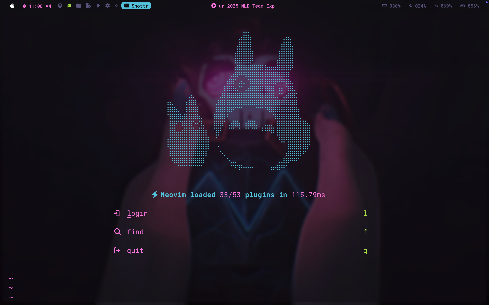
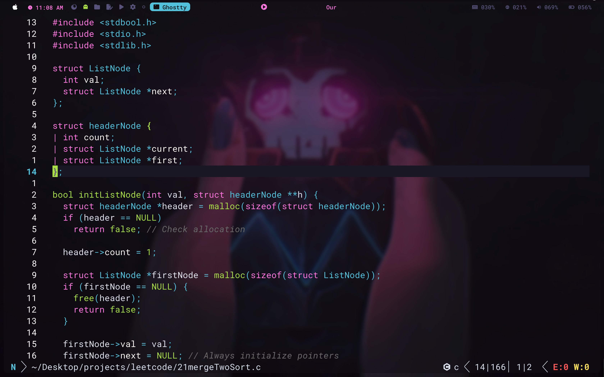

# Jinx Colorscheme + Snacks Dashboard



# Jinx Neovim Configuration 💥

Welcome to **Jinx.nvim**, a personal Neovim configuration crafted for **speed,
clarity, and flexibility** — inspired by the chaos and creativity of Jinx from
_Arcane_. This setup works seamlessly on both **macOS** and **Linux**.



---

## 📂 Directory Structure

```text
~/.config/nvim/
├── init.lua              # Main entrypoint
├── lua/
│   ├── core/              # Core settings (options, keybinds, autocmds, etc.)
│   ├── plugins/           # Individual plugin configurations
├── colors/                 # Custom colorschemes
├── docs/                    # Documentation and performance notes
├── ftplugin/               # Filetype-specific tweaks
├── retired/                # Retired plugin/lua files
```

---

## 💻 System Requirements

### macOS

```sh
brew install neovim ruby node python3
```

### Ubuntu/Linux

```sh
sudo apt-get install neovim ruby nodejs python3
```

Additionally, ensure Mason tools are in your `PATH`:

```sh
export PATH="$HOME/.local/share/nvim/mason/bin:$PATH"
```

---

## 🚀 Setup Instructions

1. Clone this repo into `~/.config/nvim`.
2. Open Neovim to trigger automatic plugin installation via Lazy.nvim.
3. Run the following inside Neovim to install required tools:

```vim
:MasonInstall lua_ls pyright tsserver html cssls jsonls yamlls gopls rust_analyzer solargraph
:MasonInstall stylua black isort prettier rubocop gofumpt clang-format
```

---

## 🌈 Jinx Colorscheme

| Element    | Color         |
| ---------- | ------------- |
| Text       | Pink          |
| Highlights | Electric Blue |
| Hints      | Neon Green    |
| Errors     | Red           |
| Comments   | Subtle Gray   |

---

## ⚡ Performance Tweaks

Several performance optimizations are included:

- Disabled unused providers (Python, Ruby, Node, Perl).
- Trimmed `runtimepath` to remove legacy Vim paths.
- Deferred plugin loading until actually needed.
- Removed unused plugins (`vimtex`, `processing`).
- Colorscheme loads first to prevent flickering.
- Pruned Treesitter to only essential parsers.

For full details, see: ➡️
[docs/performance-tweaks.md](./docs/performance-tweaks.md)

---

## 🔑 Complete Keybind Reference

This configuration features an extensive set of **custom keybinds**, covering
file management, LSP actions, Telescope usage, Harpoon, DAP debugging, and more.

For a complete reference, see: ➡️ [docs/keybinds.md](./docs/keybinds.md)

---

## 🔌 Plugin Overview

| Plugin                                                                                         | Usage                                      |
| ---------------------------------------------------------------------------------------------- | ------------------------------------------ |
| [`blink.cmp`](https://github.com/rcarriga/blink.cmp)                                           | Cursor movement enhancement for completion |
| [`clangd_extensions.nvim`](https://github.com/p00f/clangd_extensions.nvim)                     | Extensions for `clangd` with extra UI      |
| [`dooing`](https://github.com/HakonHarnes/dooing.nvim)                                         | TODO manager inside Neovim                 |
| [`flash.nvim`](https://github.com/folke/flash.nvim)                                            | Fast motion plugin                         |
| [`friendly-snippets`](https://github.com/rafamadriz/friendly-snippets)                         | Prebuilt snippets for multiple languages   |
| [`fzf-lua`](https://github.com/ibhagwan/fzf-lua)                                               | FZF-powered fuzzy finder in Lua            |
| [`gitsigns.nvim`](https://github.com/lewis6991/gitsigns.nvim)                                  | Git diff indicators                        |
| [`harpoon`](https://github.com/ThePrimeagen/harpoon)                                           | Quick file switching/bookmarking           |
| [`lazy.nvim`](https://github.com/folke/lazy.nvim)                                              | Plugin manager                             |
| [`luarocks.nvim`](https://github.com/williamboman/luarocks.nvim)                               | Luarocks integration for Neovim            |
| [`LuaSnip`](https://github.com/L3MON4D3/LuaSnip)                                               | Snippet engine                             |
| [`markdown-preview.nvim`](https://github.com/iamcco/markdown-preview.nvim)                     | Preview markdown in browser                |
| [`mason-lspconfig.nvim`](https://github.com/williamboman/mason-lspconfig.nvim)                 | Bridge for Mason and LSP config            |
| [`mason-tool-installer.nvim`](https://github.com/WhoIsSethDaniel/mason-tool-installer.nvim)    | Auto-installs tools via Mason              |
| [`mason.nvim`](https://github.com/williamboman/mason.nvim)                                     | Package manager for LSP/DAP/tools          |
| [`maven.nvim`](https://github.com/technotes/maven.nvim)                                        | Maven project management for Java          |
| [`mini.nvim`](https://github.com/echasnovski/mini.nvim)                                        | Collection of minimal Lua modules          |
| [`modicator.nvim`](https://github.com/mawkler/modicator.nvim)                                  | Mode indicator for the statusline          |
| [`neoscroll.nvim`](https://github.com/karb94/neoscroll.nvim)                                   | Smooth scrolling                           |
| [`noice.nvim`](https://github.com/folke/noice.nvim)                                            | Better UI for messages, cmdline, etc.      |
| [`none-ls-extras.nvim`](https://github.com/nvimtools/none-ls-extras.nvim)                      | Extra formatters/linters for `none-ls`     |
| [`none-ls.nvim`](https://github.com/nvimtools/none-ls.nvim)                                    | Null-ls fork for diagnostics/formatting    |
| [`nui.nvim`](https://github.com/MunifTanjim/nui.nvim)                                          | UI framework for Neovim                    |
| [`nvim-dap`](https://github.com/mfussenegger/nvim-dap)                                         | Debug Adapter Protocol support             |
| [`nvim-dap-ui`](https://github.com/rcarriga/nvim-dap-ui)                                       | UI for `nvim-dap`                          |
| [`nvim-dap-virtual-text`](https://github.com/theHamsta/nvim-dap-virtual-text)                  | Inline DAP variable values                 |
| [`nvim-emmet`](https://github.com/aca/emmet-ls)                                                | Emmet support                              |
| [`nvim-highlight-colors`](https://github.com/brenoprata10/nvim-highlight-colors)               | Highlight hex/rgb/css colors               |
| [`nvim-jdtls`](https://github.com/mfussenegger/nvim-jdtls)                                     | Java LSP support                           |
| [`nvim-lspconfig`](https://github.com/neovim/nvim-lspconfig)                                   | Configs for built-in LSP                   |
| [`nvim-nio`](https://github.com/nvim-neotest/nvim-nio)                                         | Async IO helper used by other plugins      |
| [`nvim-spectre`](https://github.com/nvim-pack/nvim-spectre)                                    | Search/replace across files                |
| [`nvim-treesitter`](https://github.com/nvim-treesitter/nvim-treesitter)                        | Better syntax parsing                      |
| [`nvim-web-devicons`](https://github.com/nvim-tree/nvim-web-devicons)                          | File icons                                 |
| [`palette.nvim`](https://github.com/roobert/palette.nvim)                                      | Easily define and switch colorschemes      |
| [`persistence.nvim`](https://github.com/folke/persistence.nvim)                                | Session management                         |
| [`plenary.nvim`](https://github.com/nvim-lua/plenary.nvim)                                     | Lua helper functions                       |
| [`render-markdown.nvim`](https://github.com/MeanderingProgrammer/render-markdown.nvim)         | Live preview markdown inline               |
| [`rest.nvim`](https://github.com/rest-nvim/rest.nvim)                                          | REST client inside Neovim                  |
| [`smear-cursor.nvim`](https://github.com/ecthelionvi/smear-cursor.nvim)                        | Smear trail effect for cursor              |
| [`snacks.nvim`](https://github.com/tummychow/snacks.nvim)                                      | QOL improvements (like Alt-based motions)  |
| [`substitute.nvim`](https://github.com/gbprod/substitute.nvim)                                 | Replace text with motions                  |
| [`telescope-dap.nvim`](https://github.com/nvim-telescope/telescope-dap.nvim)                   | DAP extension for Telescope                |
| [`telescope.nvim`](https://github.com/nvim-telescope/telescope.nvim)                           | Fuzzy finder with preview                  |
| [`tiny-devicons-auto-colors.nvim`](https://github.com/adelarsq/tiny-devicons-auto-colors.nvim) | Auto color devicons                        |
| [`toggleterm.nvim`](https://github.com/akinsho/toggleterm.nvim)                                | Floating terminals                         |
| [`transparent.nvim`](https://github.com/xiyaowong/transparent.nvim)                            | Toggle transparent background              |
| [`trouble.nvim`](https://github.com/folke/trouble.nvim)                                        | Pretty diagnostics panel                   |
| [`vim-surround`](https://github.com/tpope/vim-surround)                                        | Surround text objects easily               |
| [`vim-tmux-navigator`](https://github.com/christoomey/vim-tmux-navigator)                      | Seamless pane navigation                   |
| [`which-key.nvim`](https://github.com/folke/which-key.nvim)                                    | Popup keybinding helper                    |
| [`yanky.nvim`](https://github.com/gbprod/yanky.nvim)                                           | Better yank/paste history                  |

---

## 🛠️ Debugging Tools

| Command         | Purpose                   |
| --------------- | ------------------------- |
| `:Lazy profile` | Profile plugin load times |
| `:LspInfo`      | Show active LSP servers   |
| `:checkhealth`  | Diagnose general issues   |
| `:verbose map`  | Show mapped keys          |
